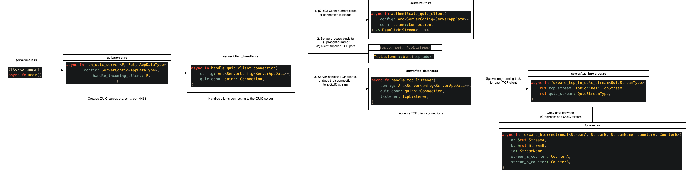
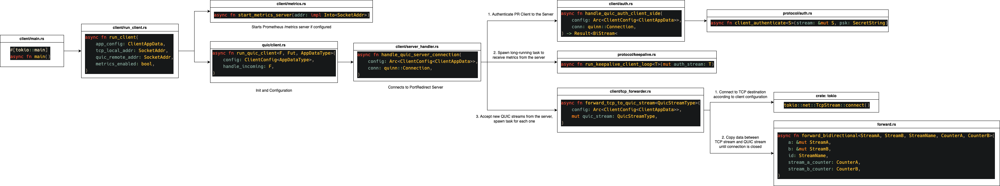

# PortRedirect

This document gives an overview of the codebase.
How client and server talk to each other is described in [docs/PROTOCOL.md](docs/PROTOCOL.md), the security model in [SECURITY.md](SECURITY.md).

## Modules

| Path                   | Purpose                                                                                                      |
| ---------------------- | ------------------------------------------------------------------------------------------------------------ |
| `src/server/`          | `portredirect_server`: program (`main.rs`), its configuration from command line and file (`config.rs`), the clients it accepts (`clients.rs`), handling of one client connection (`client_handler.rs`) including its authentication (`auth.rs`), which client holds which port (`port_registry.rs`), listener for external TCP connections with its limits (`tcp_listener.rs`), forwarding and metrics. |
| `src/client/`          | `portredirect_client`: program (`main.rs`), its configuration from command line and file (`config.rs`), connecting and reconnecting (`run_client.rs`, `reconnect.rs`), handling of the server connection (`server_handler.rs`) including the authentication (`auth.rs`), forwarding to the destination, Prometheus endpoint (`metrics.rs`). |
| `src/protocol/`        | Messages on the control stream: authentication (`auth.rs`), message and parameter format (`message.rs`), `HELLO`/`WELCOME` (`control.rs`), keepalive and `DRAIN` (`keepalive.rs`). Header and error codes of data streams (`data_stream.rs`), codes for closing connections (`close.rs`). |
| `src/quic/`            | QUIC endpoints of both sides, certificate loading and generation, protocol versions (ALPN) and transport settings, admission of new connections on the server. |
| `src/limits.rs`        | Connection limits per address, blocking of addresses after failed authentication attempts.                   |
| `src/forward.rs`       | Copies data in both directions between a TCP connection and a QUIC stream, passes on aborts, closes idle connections. |
| `src/config.rs`        | Configuration files: reading them, their precedence and values, shared by both binaries.                     |
| `src/psk.rs`           | Command-line options for the pre-shared key and loading it, shared by both binaries.                         |
| `src/private_files.rs` | Creates and checks files and directories holding secrets.                                                    |
| `src/lib.rs`           | Protocol constants, logging setup and signal handling, shared by both binaries.                              |
| `tests/*.rs`           | Integration tests, `tunnel_end_to_end.rs` runs complete tunnels in-process, including the limits and reconnecting. |
| `tests/*.bats`         | End-to-end tests and benchmarks of the release binaries with external tools.                                 |
| `utils/`               | Benchmark, plotting and documentation tools.                                                                 |

## Call Hierarchy

These graphs should help see which part of the codebase does what.
Full resolution graphs/source files are located in `./docs/*.drawio`.

> **Note:** The graphs are not up to date:
>
> - After authentication, the client's `handle_quic_server_connection` sends `HELLO` with `protocol::control::request_listen_port`, and the server's `handle_quic_client_connection` reads it with `receive_hello`, takes the port from the `PortRegistry` and answers with `send_welcome`.
> - Both sides forward data streams with `forward::forward_tcp_and_quic`.
> - The client's `run_client` connects in a loop: `run_connection` connects with `QuicClient::connect` and calls `handle_quic_server_connection`; `reconnect::is_permanent_error` decides whether to connect again.

### Server

### Client

