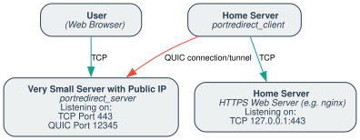

# PortRedirect

*Glue your frontend to the backend!*


## Introduction

PortRedirect is a lightweight user-space TCP forwarder that bridges your frontend and backend via a secure QUIC tunnel. It has two components:

- **Server:** Listens for incoming TCP connections (e.g., on port 443) and tunnels them over a persistent QUIC connection.
- **Client:** Connects to the QUIC server, receives tunneled streams, and forwards them to the target TCP service (e.g., `localhost:4433`).

Both use a pre-shared key (PSK) for authentication. The server auto-generates a self-signed certificate and private key on first run (stored in `~/.config/portredirect`). The client verifies the server by the certificate's fingerprint or a copy of the certificate, see [Server Certificate](#server-certificate).

### **Bling:**

[](https://codecov.io/gh/FionaPreroll/vibe-portredirect)

### Concept

In this example, we compare two methods for a web browser to reach a secure HTTPS server:

- **Baseline (Direct) Connection:**  
  The user's web browser establishes a direct TCP connection to a public web server hosting HTTPS (Figure 1).

- **Tunneled Connection via PortRedirect:**
  In this scenario, a home server running PortRedirect's client establishes a secure QUIC tunnel with the small cheap public server, which then forwards incoming connections to us. The connections get patched through to a local HTTPS server (see Figure 2).
  The public side running PortRedirect's server can then accept TCP connections from browsers. By forwarding them through the established QUIC tunnel, they can communicate with the HTTPS server, almost as if we had rented a big publicly reachable server.

> **Note:** The arrows in the following diagrams indicate the initiator of the connection (not necessarily the direction of data flow, which can always be bidirectional).

#### Figure 1: Direct TCP Connection


*In this scenario, the user's web browser connects directly to the public HTTPS server using a standard TCP connection.*

#### Figure 2: Tunneled Connection via PortRedirect



*In the tunneled scenario, the user's web browser still initiates a TCP connection to the public endpoint. However, the connection is then forwarded through a secure QUIC tunnel, established between the home server (portredirect_client) and the frontend server (portredirect_server), to reach the internal HTTPS server.*

## Installation

Build both binaries from a checkout of this repository (requires Rust 1.88 or newer):

```sh
cargo install --locked --path .
```

`--locked` uses the dependency versions from `Cargo.lock`, which are the ones tested and audited in CI.

> **Note:** The latest `portredirect` package on crates.io, version 0.3.0, predates the current protocol version 5 (see [docs/PROTOCOL.md](docs/PROTOCOL.md)) and can't talk to this version. It will be updated once this version has proven stable in practice. Server and client must speak the same protocol version.
> [CHANGELOG.md](CHANGELOG.md) lists the changes between versions and which ones changed the protocol.

## Usage

### Running the Frontend Server

For example, if your public server (accessible on TCP port 443) should forward traffic over a VPN (with an internal IP of `10.0.0.1`) on port 12345, run:

```sh
portredirect_server \
    --listen-host 0.0.0.0 --allowed-client-ports 443 \
    --quic-listen-host 10.0.0.1 --quic-listen-port 12345 \
    --quic-cert-hostname 10.0.0.1 \
    --psk-file /etc/portredirect/psk
```

**Parameters:**

- **`--listen-host`:** Where to listen for incoming TCP connections.
- **`--allowed-client-ports`:** TCP ports clients may ask the server to listen on, e.g. `443` or `80,443,8000-8100`.
- **`--quic-listen-host` & `--quic-listen-port`:** Where to listen for the QUIC tunnel (UDP).
- **`--quic-cert-hostname`:** IP address or DNS name the generated certificate is issued for, the client verifies it. Only used when the certificate is generated on first start (default `127.0.0.1`).
- **`--psk-file`:** File containing the pre-shared key, see [PSK Best Practices](#psk-best-practices).
- **`--config-file`:** TOML file with settings, e.g. a list of clients, see [Configuration File](#configuration-file).
- **`--config-dir`:** Where the certificate and private key are stored (default `~/.config/portredirect`). If only one of them is there, the server doesn't start, instead of generating a new pair that clients wouldn't trust.
- **`--print-quic-cert-fingerprint`:** Print the fingerprint of the certificate, for the clients' `--quic-cert-fingerprint`, and exit, see [Server Certificate](#server-certificate). If there is no certificate yet, generates it first.
- **`--provide-metrics`:** Serve Prometheus metrics at `http://127.0.0.1:9899/metrics`, or at the address given with `--metrics-listen`, see [Metrics](#metrics). The endpoint has no authentication, only make it reachable from trusted networks.
- **`--print-metrics`:** Print the metrics to stderr when they change, each summed over all clients.
- **`--shutdown-timeout`:** Seconds that running forwarded connections may take to finish when the server shuts down (default 5), see [Shutting Down](#shutting-down).
- **`--log-level`:** `off`, `error`, `warn`, `info` (default), `debug` or `trace`. Logs go to stderr. The `RUST_LOG` environment variable, if set, takes precedence and can set levels per module, e.g. `RUST_LOG=info,portredirect::forward=debug`.

**Limits** for the resources a single host can use:

- **`--max-quic-connections`:** Maximum number of QUIC connections, including connections that are not authenticated yet (default 64). Each client uses one.
- **`--max-connections`:** Maximum number of concurrently forwarded TCP connections per client (default 512). Further connections wait until one ends.
- **`--max-connections-per-ip`:** Maximum number of concurrently forwarded TCP connections per external IP address, for IPv6 per /64 network (default 64, `0` for no limit). Further connections are closed right away. Raise it if many users share an address, e.g. behind a NAT.
- **`--idle-timeout`:** Close forwarded TCP connections after this many seconds without data transfer (default 600, `0` to never close idle connections). Raise it for protocols with long idle times, e.g. SSH without keep-alive messages.

The server also limits the QUIC connections per address, gives clients 10 seconds for the TLS handshake and blocks addresses for 10 minutes after repeated failed attempts, see [Limits](docs/PROTOCOL.md#limits).

### Running the Backend Client

To forward traffic to a local service (e.g., an `nginx` server on `127.0.0.1:4433`), run:

```sh
portredirect_client \
    --destination-host 127.0.0.1 --destination-port 4433 \
    --remote-listen-port 443 \
    --quic-remote-host 10.0.0.1 --quic-remote-port 12345 \
    --quic-cert-fingerprint sha256:<fingerprint of the server's certificate> \
    --psk-file /etc/portredirect/psk
```

**Parameters:**

- **`--destination-host` & `--destination-port`:** The target TCP service.
- **`--remote-listen-port`:** The TCP port the server should listen on for you. Must be one of the server's `--allowed-client-ports`.
- **`--quic-remote-host` & `--quic-remote-port`:** The QUIC server’s address.
- **`--quic-cert-fingerprint`** (recommended): Trust the server's certificate by its fingerprint instead of a copy of `cert.der`, see [Server Certificate](#server-certificate). Give it several times to trust several certificates, e.g. while the server's certificate changes.
- **`--quic-cert-hostname`** (optional): Name the server's certificate must be issued for, if it differs from `--quic-remote-host`. Must match the server's `--quic-cert-hostname`. Not checked with `--quic-cert-fingerprint`.
- **`--psk-file`:** File containing the pre-shared key, must match the server’s PSK.
- **`--client-name`** (optional): Name the client authenticates with, 1 to 64 letters, digits, dots, underscores or hyphens (default `default`). A server configured with `--psk-file` and `--allowed-client-ports` knows a single client named `default`, see [Several Clients and Standby](#several-clients-and-standby).
- **`--config-file`:** TOML file with settings, see [Configuration File](#configuration-file).
- **`--config-dir`:** Where the server's certificate `cert.der` is read from, unless `--quic-cert-fingerprint` is given (default `~/.config/portredirect`).
- **`--max-connections`:** Maximum number of concurrently forwarded connections (default 512).
- **`--provide-metrics`:** Serve Prometheus metrics at `http://127.0.0.1:9898/metrics`, or at the address given with `--metrics-listen`, see [Metrics](#metrics). The endpoint has no authentication, only make it reachable from trusted networks.
- **`--shutdown-timeout`** and **`--log-level`:** As for the server.

> **Important:** The client must trust the server's certificate. Start the server first to generate it, then give the client the certificate's fingerprint with `--quic-cert-fingerprint`, see [Server Certificate](#server-certificate).
> Or copy **only the certificate** `~/.config/portredirect/cert.der` from the server to the client's configuration directory (by default the same path).
> Never copy the private key `key.der`: anyone who has it can impersonate your server. The server creates it readable only by its owner (mode `0600`) and warns if it is accessible by others.

### Configuration File

Both programs can read their settings from a [TOML](https://toml.io) file given with `--config-file`.
Its keys are the names of the options without the leading dashes, and its values are written like on the command line:

```toml
# /etc/portredirect/client.toml
destination-host = "127.0.0.1"
destination-port = 4433
remote-listen-port = 443
quic-remote-host = "10.0.0.1"
quic-remote-port = 12345
quic-cert-fingerprint = "sha256:<fingerprint of the server's certificate>"
psk-file = "psk"
log-level = "warn"
```

```sh
portredirect_client --config-file /etc/portredirect/client.toml
```

- **Precedence:** Options on the command line or in the environment (`PORTREDIRECT_PSK`) take precedence over the file, and the file over the defaults. So `--log-level debug` overrides the file for a single run. Flags like `--print-metrics` can only switch a setting on.
- **No secrets:** The file only names the files that hold the PSKs; it has no key for a PSK itself.
- **Paths:** Relative paths in the file, e.g. `psk-file` or `config-dir`, are relative to the file's directory, not to the working directory.
- **Checked:** Unknown keys, e.g. typos, and invalid values are errors: the program names the line and exits with code 2.
- **Ports:** `allowed-client-ports` and the ports of clients can also be arrays, e.g. `[80, 443, "8000-8100"]`.
- **Several values:** An option that can be given several times takes an array, e.g. `quic-cert-fingerprint = ["sha256:…", "sha256:…"]`.

### Several Clients and Standby

The server's configuration file can list several clients, each with its own name, PSK and ports, instead of the single client given by `psk-file` and `allowed-client-ports`:

```toml
# /etc/portredirect/server.toml
listen-host = "0.0.0.0"
quic-listen-host = "10.0.0.1"
quic-listen-port = 12345
quic-cert-hostname = "10.0.0.1"

[[clients]]
name = "web"
psk-files = ["clients/web.psk"]
ports = "80,443"

[[clients]]
name = "web-standby"
psk-files = ["clients/web-standby.psk"]
ports = "80,443"

[[clients]]
name = "mail"
psk-files = ["clients/mail.psk", "clients/mail-next.psk"]
ports = [25, 465, 993]
```

Each client names itself with `--client-name`, or `client-name` in its configuration file, and uses the PSK of its name.
A client can only use its own ports, so it can't take over another client's port, e.g. while that client reconnects.

- **Standby:** Clients may share ports on purpose, like `web` and `web-standby` above, e.g. for a second machine that takes over when the first one fails. Whichever client connects first gets a port; the other one keeps trying to connect (see [Reconnects and Exit Codes](#reconnects-and-exit-codes)) and gets the port once it is free. The server logs which clients share which ports when it starts, so an overlap by mistake doesn't go unnoticed.
- **Changing a PSK:** A client can have two PSK files while its PSK changes, like `mail` above. Add the new PSK file on the server and restart it, switch the client to the new PSK, then remove the old file from the server's configuration.
- **Logs:** The server's log messages name the client of each connection.

### Server Certificate

On its first start, the server generates a self-signed certificate and its private key, `cert.der` and `key.der` in its configuration directory.
A client trusts the server in one of two ways:

- **By fingerprint** (recommended): the SHA-256 hash of the certificate, given with `--quic-cert-fingerprint`, or `quic-cert-fingerprint` in the configuration file. It is a line of text, e.g. for a service file or configuration management, so no file needs to be copied. The client doesn't check the name the certificate is issued for, nor how long it is valid, as the fingerprint stands for exactly one certificate.
- **By a copy** of `cert.der` in the client's configuration directory. The client also checks that the certificate is issued for its `--quic-cert-hostname`, or for the address of `--quic-remote-host`.

A fingerprint is `sha256:` and 64 hex digits. Get it on the server in either of these ways, or from the server's log, which shows it when the server starts:

```sh
portredirect_server --config-file /etc/portredirect/server.toml --print-quic-cert-fingerprint
sha256sum ~/.config/portredirect/cert.der    # the same digits, without sha256:
```

The client also accepts it without `sha256:`, and with colons between the bytes, as `openssl x509 -fingerprint -sha256` prints it.

#### Changing the Server Certificate

E.g. if the private key may have been exposed, or the certificate should be issued for another name.
With fingerprints, the clients trust the new certificate before the server uses it, so they only reconnect:

1. Prepare the new certificate in another directory. This prints its fingerprint:
   ```sh
   portredirect_server --config-dir /etc/portredirect/next --quic-cert-hostname 10.0.0.1 --print-quic-cert-fingerprint
   ```
2. On every client, add the new fingerprint to the old one and restart the client:
   ```toml
   quic-cert-fingerprint = ["sha256:<old fingerprint>", "sha256:<new fingerprint>"]
   ```
3. Move `cert.der` and `key.der` from `/etc/portredirect/next` into the server's configuration directory, replacing the old ones, and restart the server. The clients reconnect and trust the new certificate.
4. Remove the old fingerprint from the clients, and delete any copies of the old private key.

Clients that trust a copy of `cert.der` need the new one at step 3, so switch them to fingerprints first.

### Reconnects and Exit Codes

The client keeps the tunnel up on its own: whenever the connection to the server ends, it connects again, after 1 second at first and up to 60 seconds after repeated failures.
It only exits:

- with code 0 on `SIGINT` or `SIGTERM`, after letting running connections finish, see [Shutting Down](#shutting-down);
- with code 1 if connecting again would fail the same way until the configuration changes, e.g. because the server rejects the PSK or the port, or the server's certificate has none of the fingerprints or doesn't match `cert.der`;
- with code 1 if another client with the same name took over the port, e.g. a second instance by mistake: otherwise, the two would take the port from each other in turns;
- with code 2 on invalid command-line arguments or an invalid configuration file.

Under a service manager, restart the client on failures only, and not right away, e.g. with systemd:

```ini
[Service]
ExecStart=/usr/local/bin/portredirect_client --config-file /etc/portredirect/client.toml
Restart=on-failure
RestartSec=60
```

When the server shuts down, its clients notice right away and connect again once it is back.

If the client connects again while the server still holds the port for its previous connection, e.g. after the client crashed, the new connection replaces the previous one right away.

### Shutting Down

On `SIGINT` or `SIGTERM`, both programs shut down gracefully, e.g. for an update:

1. They start no new forwarded connections and tell the other side with `DRAIN`. The server closes its TCP listeners and refuses new clients. A client makes the server close its TCP listener and release the port right away, so another client can take it, e.g. a [standby client](#several-clients-and-standby) or a new instance.
2. Running forwarded connections may finish, for at most `--shutdown-timeout` seconds (default 5). Idle connections, e.g. HTTP keep-alive connections, hold up the shutdown until the timeout, too.
3. Then they close the rest, and the connection between them, so the other side notices right away.

A second `SIGINT` or `SIGTERM` closes the running connections right away.
Keep the timeout shorter than the time a service manager waits before it kills the program, e.g. `TimeoutStopSec` of systemd (90 seconds by default) or the stop timeout of Docker (10 seconds by default).

### Metrics

With `--provide-metrics`, both programs serve [Prometheus](https://prometheus.io) metrics at `/metrics`: the client on `127.0.0.1:9898` by default, the server on `127.0.0.1:9899`.
All metrics are listed from the start, with 0. Metrics of the server's clients have the label `client` with the client's name; they are listed for all configured clients.

| Server metric (`portredirect_server_…`)           | Type    | Labels   | Meaning                                                                                       |
| ------------------------------------------------- | ------- | -------- | --------------------------------------------------------------------------------------------- |
| `quic_connections_refused_total`                  | counter | `reason` | QUIC connections refused before the TLS handshake: `blocked`, `connection_limit`, `address_limit` or `shutting_down`. |
| `authentication_failures_total`                   | counter |          | Failed TLS handshakes and authentication attempts, which count towards blocking an address.   |
| `tunnels_total`                                   | counter | `client` | Tunnels set up: the client authenticated and the server listens for it.                      |
| `tunnels_active`                                  | gauge   | `client` | Tunnels that are up.                                                                          |
| `keepalive_failures_total`                        | counter | `client` | Tunnels closed because no keepalive message arrived in time.                                 |
| `forwarded_connections_total`                     | counter | `client` | External connections forwarded through the tunnel.                                           |
| `forwarded_connections_active`                    | gauge   | `client` | Forwarded connections that are running.                                                       |
| `forwarded_connections_refused_total`             | counter | `client` | External connections closed right away, as their address had too many connections.          |
| `forwarded_connections_failed_total`              | counter | `client` | External connections that couldn't be forwarded, as the client accepted no stream for them.  |
| `forwarded_connections_aborted_total`             | counter | `client` | Forwarded connections that ended with an error, e.g. an abort.                               |
| `accept_errors_total`                             | counter | `client` | Failures to accept an external connection, e.g. for lack of file descriptors.                |
| `bytes_from_external_total`                       | counter | `client` | Bytes received from external connections.                                                    |
| `bytes_to_external_total`                         | counter | `client` | Bytes sent to external connections.                                                          |

| Client metric (`portredirect_client_…`)           | Type    | Meaning                                                                             |
| ------------------------------------------------- | ------- | ----------------------------------------------------------------------------------- |
| `connection_attempts_total`                       | counter | Attempts to connect to the server.                                                  |
| `tunnels_total`                                   | counter | Tunnels set up: the client connected, authenticated and the server listens for it. |
| `tunnel_up`                                       | gauge   | 1 while the tunnel is up, else 0. Alert on it.                                      |
| `keepalive_failures_total`                        | counter | Tunnels closed because the server didn't answer keepalive messages.                |
| `forwarded_connections_total`                     | counter | Connections the server forwarded through the tunnel.                               |
| `forwarded_connections_active`                    | gauge   | Forwarded connections that are running.                                             |
| `forwarded_connections_aborted_total`             | counter | Forwarded connections that ended with an error, e.g. an abort.                     |
| `destination_connect_failures_total`              | counter | Forwarded connections for which the destination couldn't be reached.              |
| `bytes_to_destination_total`                      | counter | Bytes sent to the destination.                                                      |
| `bytes_from_destination_total`                    | counter | Bytes received from the destination.                                                |

From 1.0 on, the names and labels of the metrics only change with a new major version.

### PSK Best Practices

Always use a long, random pre-shared key when operating over untrusted networks. Generate it once and store it in a file that only the user running PortRedirect can read, then copy that file to the other machine via a secure channel:

```sh
(umask 077 && mkdir -p /etc/portredirect && openssl rand -hex 32 > /etc/portredirect/psk)
```

Both programs accept the PSK from one of these sources:

- **`--psk-file <PATH>`** (recommended): Reads the PSK from a file, trailing line breaks are ignored. PortRedirect warns if the file is accessible by other users. In the [configuration file](#configuration-file), the same is `psk-file`, or `psk-files` for each of the server's [clients](#several-clients-and-standby).
- **`PORTREDIRECT_PSK`** environment variable: Useful for container or service managers that inject secrets.
- **`--psk <PSK>`**: Avoid this outside of testing. Command-line arguments are visible to every local user in the process list (`ps`, `/proc/<pid>/cmdline`) and end up in shell histories, so PortRedirect warns when it is used.

A PSK given on the command line or in the environment takes precedence over the configuration file.

## Authentication & Certificate Verification

PortRedirect secures QUIC tunnels using auto-generated certificates and a pre-shared key (PSK). The client verifies the server’s certificate, by its fingerprint or a copy, then the client names itself, and client and server prove to each other that they know the client's PSK, with HMAC proofs bound to the TLS session.
Only after that, the server opens the TCP port the client asked for. Addresses that fail to authenticate repeatedly are blocked for a while.

- [docs/PROTOCOL.md](docs/PROTOCOL.md) describes the protocol in detail.
- [SECURITY.md](SECURITY.md) describes the security model, known limitations and how to report vulnerabilities.

## Development

### Getting Started

To get an overview of the codebase, use [ARCHITECTURE.md](./ARCHITECTURE.md) as an entry point.

### Tests

Run the Cargo tests and the Python unit tests of the benchmark utilities:

```sh
make test
```

The Cargo tests include end-to-end tests of a complete tunnel in `src/tests/tunnel_end_to_end.rs` and tests of the two programs in `tests/cli.rs`.

To see which code the Cargo tests cover, install [cargo-llvm-cov](https://github.com/taiki-e/cargo-llvm-cov) and run `make coverage`.
It prints a summary per file and writes an HTML report with the covered lines to `target/llvm-cov/html`.

Before committing, run the linters (`cargo fmt --check`, `cargo clippy` and, if installed, `black`):

```sh
make lint
```

### BATS Tests

The BATS tests run the release binaries with real tools (`iperf3`, `nc`, `pv`, `curl` and the Python utilities in `utils/`).
Install [BATS-Core](https://github.com/bats-core/bats-core) and these tools, then run all of them with `make test_bats`, or a single one with:

```sh
bats tests/<test_file.bats>
```

## Command-Line Help

Both programs print their version with `--version`. For a complete list of options:

- **Server Help:**  

  ```sh
  portredirect_server --help
  ```

- **Client Help:**  

  ```sh
  portredirect_client --help
  ```

- **Developer Help:**  

  ```sh
  # This means please look at the documentation inside the supplied `Makefile`
  less Makefile
  ```

## Overview & Limitations

PortRedirect is ideal for simple TCP-to-QUIC tunneling setups:

- **Protocol Support:** Currently supports IPv4 and TCP.
- **Connection Model:** Each client gets its own TCP port on the server. Several clients can share a server, each with its own PSK and ports, and clients can share a port as standby, see [Several Clients and Standby](#several-clients-and-standby).
- **Scalability:** Not yet optimized for extremely high concurrency, a client forwards at most 512 connections at the same time by default.
- **Reliability:** The client reconnects on its own, see [Reconnects and Exit Codes](#reconnects-and-exit-codes). Aborted connections are passed on: if one side resets its TCP connection, or the tunnel breaks down, the other side's connection is reset, too, so truncated transfers don't look complete.
- **Security:** We try our best but no guarantees, see the known limitations in [SECURITY](SECURITY.md#known-limitations).

## License

This project is licensed under the [GPL-3.0-only](LICENSE) license.
